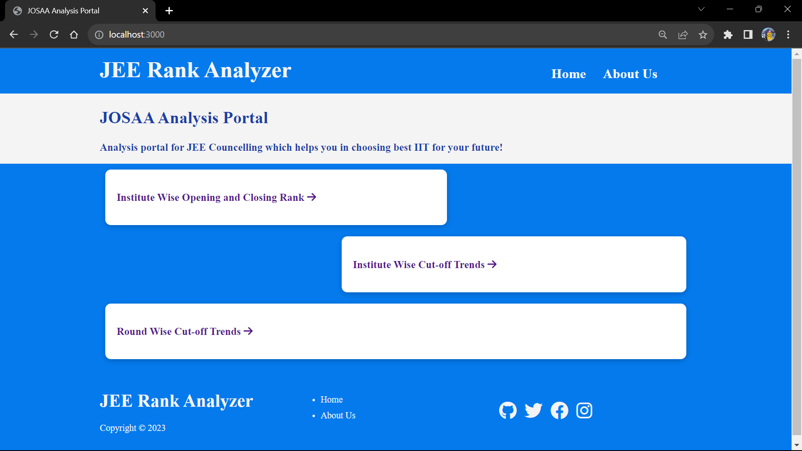
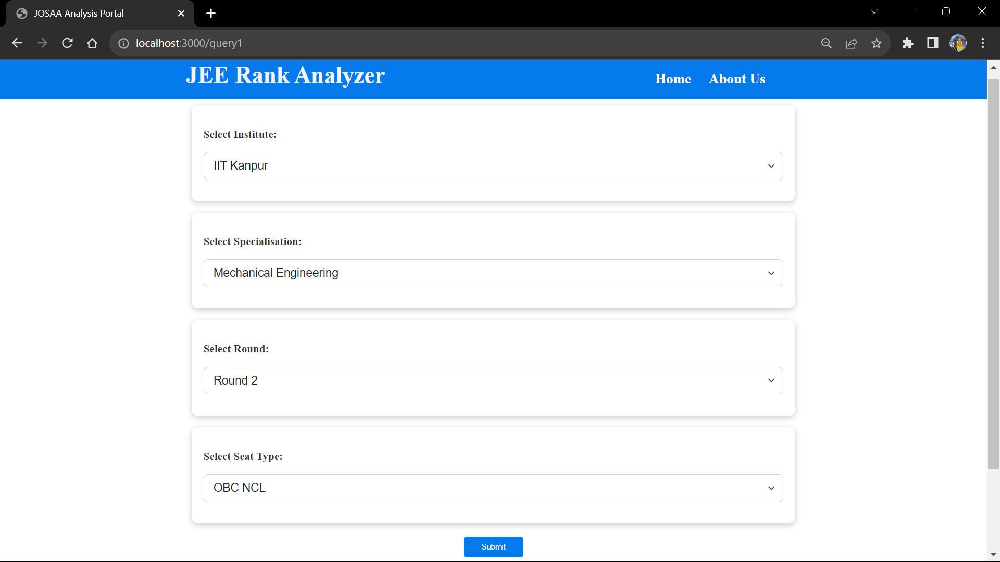
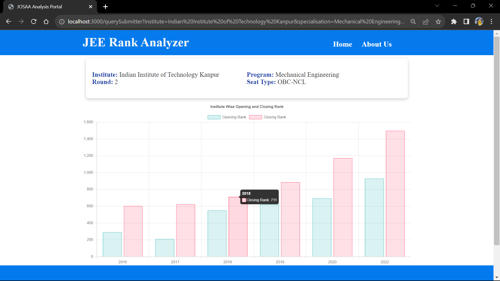
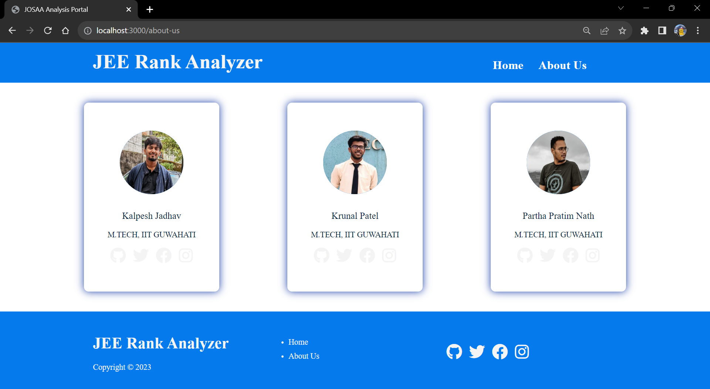

# josaa_project -> JEE Rank Analyzer
JOSAA Data Analysis website

From - Coding Club, Indian Institute of Technology, Guwahati

This project was given to us as part of Summer Projects.

Tasks ->
1. Get the raw data from the JOSAA Website for the JEE Exam Ranks from 2016 to 2022
2. Clean the data properly from all the anomalies
3. Create a website in which we can run the queries to extract data from our database
4. Create a visual presentation of the queries using the Graph.js library

Tech Stacks used:
1. Data Scrapping - Beautiful Soup
2. Data Cleaning - Pandas, Google Sheets
3. Database Management -> MySQL
4. Front End -> HTML, CSS, JavaScript (Graph.js)
5. Back End -> Node.js with Express.js
7. Templating Engine -> EJS

PS: MVC Architecture is used for file system

Here are some of the snapshots of our website:

